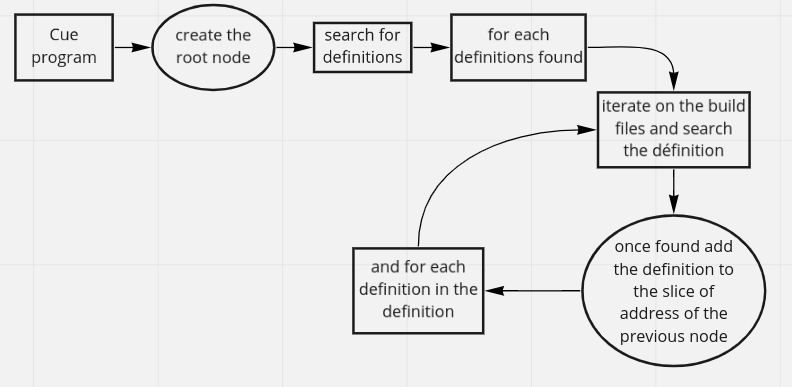
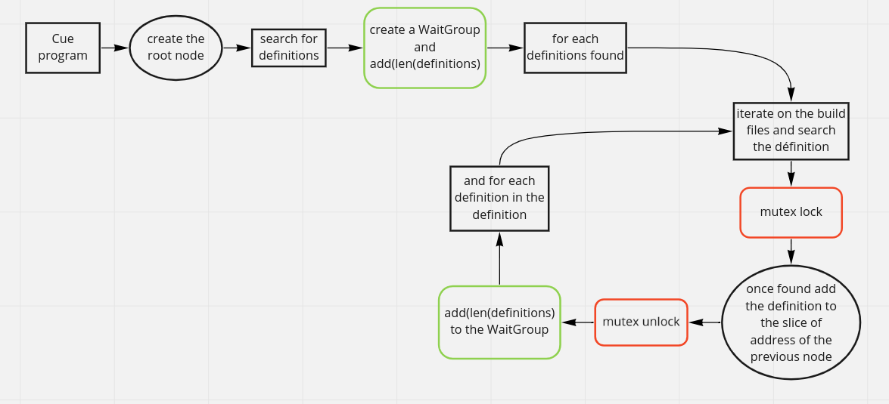

# Dagviz

### What is it?

[Dagviz](https://github.com/PoCInnovation/DagViz) is a visualization tool for Cue definitions that allows you to visualize the structure of a Cue definition through
the package including dependencies etc. This is a [PoC innovation](https://github.com/PoCInnovation/) I made during my 1st year.

### Why?

While I was working on DagViz, a part of the program where look search for definitions in the Cue program we were following
a logic simplified as follows:

This look obvious to me to parallelize here, we don't need to wait the previous definition to be found to start looking for the next one.
I naively thought that I just needed to asynchronously look for the next definition, but I was wrong.

### Problem

With my first logic I simply added the `go` keyword before the function that recursively looks for the definitions in the body of the definition.
But I encountered 2 problems:
- The output of the program is different at every run.
- There is a data race.

It didn't take me long to understand why, and I discovered 2 key concepts of concurrency programming logic :
- WaitGroup
- Mutex

####  1: WaitGroups

A WaitGroup waits for a collection of goroutines to finish. The main goroutine calls Add to inform the WaitGroup of the number of goroutines to wait for.
When all the WaitGroup's goroutines have called Done, the WaitGroup is done.

In my case, when I called asynchronously the function for each definition when one definition ended up it didn't wait the others
recursive calls to end. So it printed my DAG even if the others threads was still adding data to it. I also get a data race here
because I was trying to read and write at the same time in my data structure.

Here is why I should implement WaitGroups to prevent my program to continue before every recursive calls ended up.

#### 2: Mutex

A mutual exclusion object (mutex) is a program object that allows multiple program threads
to share the same resource, such as file access, but not simultaneously.

In this part of the program, there is a case of data race when I add the address of the new node to the slice of address of
the parent node. In a multi-thread execution, this can be a problem to append on the same slice on different thread because 
this action is not atomic, and one of the first things it does is copying the initial slice. But imagine that the both threads
add their address to the slice, but they will both have a different copy of the slice. And finally the both will set value of the original slice
to its own copy. So one of the address will be lost.

Here on this part of DagViz, I will need tou use mutex to prevent 2 access to the same slice at the same time.

### Solution

